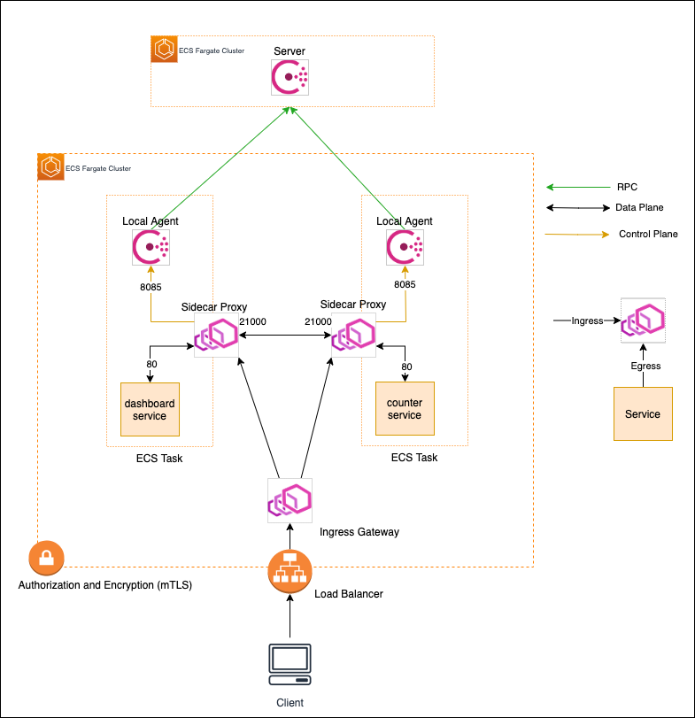
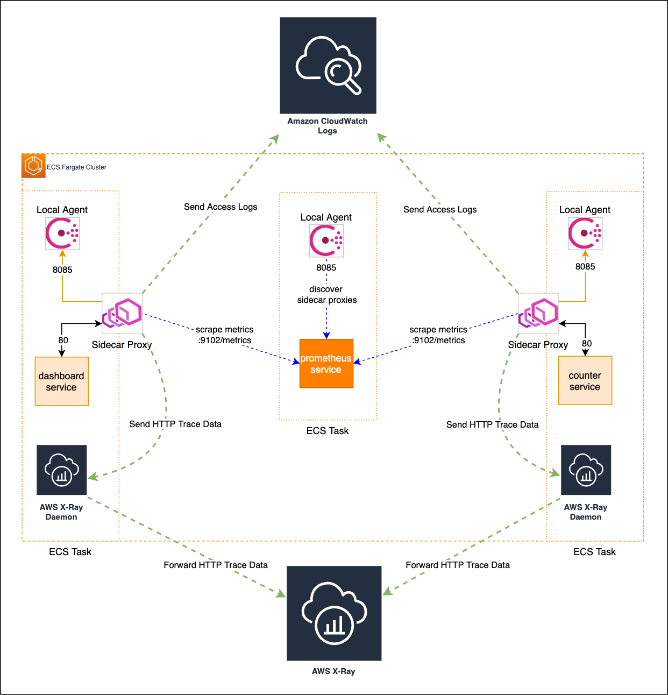
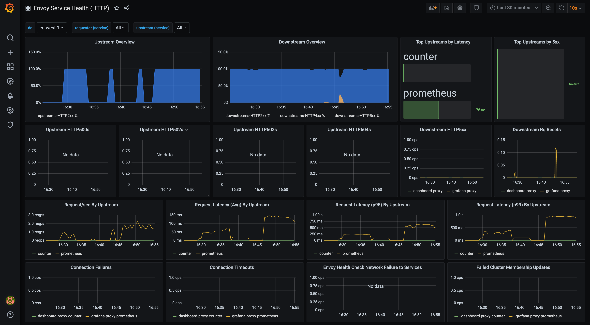
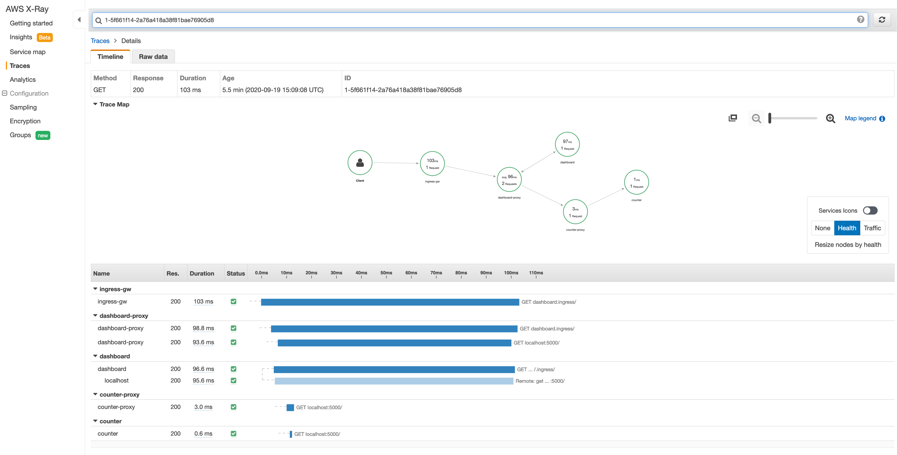
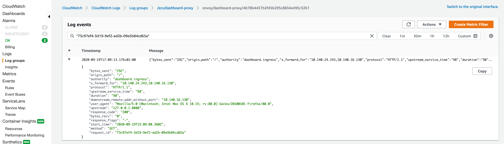
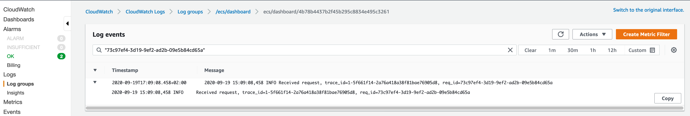

# Observability Demo in a Service Mesh

This demo showcases an implementation of Observability in a Service Mesh
created using [Consul Connect](https://www.consul.io/docs/connect). Consul Connect,
the control plane, provides service-to-service authorization
and encryption using mutual TLS and uses [Envoy](https://www.envoyproxy.io/)
as the data plane for its data transmission.

In terms of observability, this demo will cover the basic Layer 7 metrics,
access logs and distributed tracing using [Prometheus](https://prometheus.io/),
[Grafana](https://grafana.com/), [AWS CloudWatch Logs](https://docs.aws.amazon.com/AmazonCloudWatch/latest/logs/WhatIsCloudWatchLogs.html) and [AWS X-Ray](https://aws.amazon.com/xray/).

You will find an in-depth explaination on how this works in my [Medium Blogpost](https://medium.com/izettle-engineering/implementing-observability-in-a-service-mesh-273c7409283d)
and therefore, I recommend that you read it first. In this guide however, I will
show you how to set up necessary resources to run the demo.

NOTE: This demo is designed to run in AWS using [ECS](https://aws.amazon.com/ecs/)
as the container orchestrator so you will need appropriate access to create
these resources.

## Setup

In this demo, resources are created on AWS and are managed by Terraform which are of the following:

* An ECS Fargate cluster
* ECS Fargate services which are of the following:
    * HA Consul cluster
    * A Consul managed Ingress Gateway Service
    * A service called `counter`
    * A service called `dashboard` which communicates with the `counter` service
    * Grafana for viewing Layer 7 HTTP metrics
    * Prometheus which is the backend for all the metrics
* AWS CloudWatch Logs for logs
* Internal ALB for the Consul server
* Internal ALB for the Ingress Gateway
* Route53 DNS Endpoint for the Consul server

<p align="center"></p>


<details>
    <summary>
    Click here to see the full Terraform plan
    </summary>

```terraform
An execution plan has been generated and is shown below.
Resource actions are indicated with the following symbols:
  + create

Terraform will perform the following actions:

  # aws_security_group.ecs_service_sg will be created
  + resource "aws_security_group" "ecs_service_sg" {
      + arn                    = (known after apply)
      + description            = "Shared ECS SG"
      + egress                 = [
          + {
              + cidr_blocks      = [
                  + "0.0.0.0/0",
                ]
              + description      = "Allow egress from ECS service to talk to the internet via TLS"
              + from_port        = 0
              + ipv6_cidr_blocks = []
              + prefix_list_ids  = []
              + protocol         = "-1"
              + security_groups  = []
              + self             = false
              + to_port          = 0
            },
        ]
      + id                     = (known after apply)
      + ingress                = (known after apply)
      + name                   = "ecs-services"
      + owner_id               = (known after apply)
      + revoke_rules_on_delete = false
      + tags                   = {
          + "DemoName"    = "consul-connect-observability-demo"
          + "DemoTFState" = "eu-west-1/consul-connect-observability-demo.tfstate"
        }
      + vpc_id                 = "vpc-123abc"
    }

  # null_resource.deploy_consul will be created
  + resource "null_resource" "deploy_consul" {
      + id       = (known after apply)
      + triggers = (known after apply)
    }

  # null_resource.deploy_counter will be created
  + resource "null_resource" "deploy_counter" {
      + id       = (known after apply)
      + triggers = (known after apply)
    }

  # null_resource.deploy_dashboard will be created
  + resource "null_resource" "deploy_dashboard" {
      + id       = (known after apply)
      + triggers = (known after apply)
    }

  # null_resource.deploy_grafana will be created
  + resource "null_resource" "deploy_grafana" {
      + id       = (known after apply)
      + triggers = (known after apply)
    }

  # null_resource.deploy_ingress_gw will be created
  + resource "null_resource" "deploy_ingress_gw" {
      + id       = (known after apply)
      + triggers = (known after apply)
    }

  # null_resource.deploy_prometheus will be created
  + resource "null_resource" "deploy_prometheus" {
      + id       = (known after apply)
      + triggers = (known after apply)
    }

  # module.consul_server.aws_alb_target_group.grpc will be created
  + resource "aws_alb_target_group" "grpc" {
      + arn                                = (known after apply)
      + arn_suffix                         = (known after apply)
      + deregistration_delay               = 300
      + id                                 = (known after apply)
      + lambda_multi_value_headers_enabled = false
      + load_balancing_algorithm_type      = (known after apply)
      + name                               = (known after apply)
      + port                               = 8502
      + protocol                           = "TCP"
      + proxy_protocol_v2                  = false
      + slow_start                         = 0
      + tags                               = {
          + "DemoName"    = "consul-connect-observability-demo"
          + "DemoTFState" = "eu-west-1/consul-connect-observability-demo.tfstate"
          + "Environment" = "sandbox"
          + "ManagedBy"   = "Terraform"
          + "Region"      = "eu-west-1"
        }
      + target_type                        = "ip"
      + vpc_id                             = "vpc-123abc"

      + health_check {
          + enabled             = true
          + healthy_threshold   = 5
          + interval            = 10
          + matcher             = (known after apply)
          + path                = (known after apply)
          + port                = "traffic-port"
          + protocol            = "TCP"
          + timeout             = (known after apply)
          + unhealthy_threshold = 5
        }

      + stickiness {
          + cookie_duration = (known after apply)
          + enabled         = (known after apply)
          + type            = (known after apply)
        }
    }

  # module.consul_server.aws_alb_target_group.http will be created
  + resource "aws_alb_target_group" "http" {
      + arn                                = (known after apply)
      + arn_suffix                         = (known after apply)
      + deregistration_delay               = 300
      + id                                 = (known after apply)
      + lambda_multi_value_headers_enabled = false
      + load_balancing_algorithm_type      = (known after apply)
      + name                               = (known after apply)
      + port                               = 8500
      + protocol                           = "TCP"
      + proxy_protocol_v2                  = false
      + slow_start                         = 0
      + tags                               = {
          + "DemoName"    = "consul-connect-observability-demo"
          + "DemoTFState" = "eu-west-1/consul-connect-observability-demo.tfstate"
          + "Environment" = "sandbox"
          + "ManagedBy"   = "Terraform"
          + "Region"      = "eu-west-1"
        }
      + target_type                        = "ip"
      + vpc_id                             = "vpc-123abc"

      + health_check {
          + enabled             = true
          + healthy_threshold   = 5
          + interval            = 10
          + matcher             = (known after apply)
          + path                = (known after apply)
          + port                = "traffic-port"
          + protocol            = "TCP"
          + timeout             = (known after apply)
          + unhealthy_threshold = 5
        }

      + stickiness {
          + cookie_duration = (known after apply)
          + enabled         = (known after apply)
          + type            = (known after apply)
        }
    }

  # module.consul_server.aws_alb_target_group.rpc will be created
  + resource "aws_alb_target_group" "rpc" {
      + arn                                = (known after apply)
      + arn_suffix                         = (known after apply)
      + deregistration_delay               = 300
      + id                                 = (known after apply)
      + lambda_multi_value_headers_enabled = false
      + load_balancing_algorithm_type      = (known after apply)
      + name                               = (known after apply)
      + port                               = 8301
      + protocol                           = "TCP"
      + proxy_protocol_v2                  = false
      + slow_start                         = 0
      + tags                               = {
          + "DemoName"    = "consul-connect-observability-demo"
          + "DemoTFState" = "eu-west-1/consul-connect-observability-demo.tfstate"
          + "Environment" = "sandbox"
          + "ManagedBy"   = "Terraform"
          + "Region"      = "eu-west-1"
        }
      + target_type                        = "ip"
      + vpc_id                             = "vpc-123abc"

      + health_check {
          + enabled             = true
          + healthy_threshold   = 5
          + interval            = 10
          + matcher             = (known after apply)
          + path                = (known after apply)
          + port                = "traffic-port"
          + protocol            = "TCP"
          + timeout             = (known after apply)
          + unhealthy_threshold = 5
        }

      + stickiness {
          + cookie_duration = (known after apply)
          + enabled         = (known after apply)
          + type            = (known after apply)
        }
    }

  # module.consul_server.aws_lb.nlb will be created
  + resource "aws_lb" "nlb" {
      + arn                              = (known after apply)
      + arn_suffix                       = (known after apply)
      + dns_name                         = (known after apply)
      + enable_cross_zone_load_balancing = false
      + enable_deletion_protection       = false
      + id                               = (known after apply)
      + internal                         = true
      + ip_address_type                  = (known after apply)
      + load_balancer_type               = "network"
      + name                             = (known after apply)
      + security_groups                  = (known after apply)
      + subnets                          = [
          + "subnet-123abc",
          + "subnet-123def",
          + "subnet-456ghi",
        ]
      + tags                             = {
          + "DemoName"    = "consul-connect-observability-demo"
          + "DemoTFState" = "eu-west-1/consul-connect-observability-demo.tfstate"
          + "Environment" = "sandbox"
          + "ManagedBy"   = "Terraform"
          + "Region"      = "eu-west-1"
        }
      + vpc_id                           = (known after apply)
      + zone_id                          = (known after apply)

      + subnet_mapping {
          + allocation_id = (known after apply)
          + subnet_id     = (known after apply)
        }
    }

  # module.consul_server.aws_lb_listener.grpc will be created
  + resource "aws_lb_listener" "grpc" {
      + arn               = (known after apply)
      + id                = (known after apply)
      + load_balancer_arn = (known after apply)
      + port              = 8502
      + protocol          = "TCP"
      + ssl_policy        = (known after apply)

      + default_action {
          + order            = (known after apply)
          + target_group_arn = (known after apply)
          + type             = "forward"
        }
    }

  # module.consul_server.aws_lb_listener.http will be created
  + resource "aws_lb_listener" "http" {
      + arn               = (known after apply)
      + id                = (known after apply)
      + load_balancer_arn = (known after apply)
      + port              = 8500
      + protocol          = "TCP"
      + ssl_policy        = (known after apply)

      + default_action {
          + order            = (known after apply)
          + target_group_arn = (known after apply)
          + type             = "forward"
        }
    }

  # module.consul_server.aws_lb_listener.rpc will be created
  + resource "aws_lb_listener" "rpc" {
      + arn               = (known after apply)
      + id                = (known after apply)
      + load_balancer_arn = (known after apply)
      + port              = 8301
      + protocol          = "TCP"
      + ssl_policy        = (known after apply)

      + default_action {
          + order            = (known after apply)
          + target_group_arn = (known after apply)
          + type             = "forward"
        }
    }

  # module.consul_server.aws_route53_record.consul_record will be created
  + resource "aws_route53_record" "consul_record" {
      + allow_overwrite = (known after apply)
      + fqdn            = (known after apply)
      + id              = (known after apply)
      + name            = "consul"
      + type            = "A"
      + zone_id         = "Z04906902WKDNX8T05UBC"

      + alias {
          + evaluate_target_health = true
          + name                   = (known after apply)
          + zone_id                = (known after apply)
        }
    }

  # module.consul_server.aws_security_group.consul_client will be created
  + resource "aws_security_group" "consul_client" {
      + arn                    = (known after apply)
      + description            = "Consul Clients connectivity SG"
      + egress                 = (known after apply)
      + id                     = (known after apply)
      + ingress                = [
          + {
              + cidr_blocks      = [
                  + "10.140.0.0/18",
                ]
              + description      = "The port used by clients to talk to the HTTP API. Also used for NLB Target Group health check"
              + from_port        = 8500
              + ipv6_cidr_blocks = []
              + prefix_list_ids  = []
              + protocol         = "tcp"
              + security_groups  = []
              + self             = false
              + to_port          = 8500
            },
          + {
              + cidr_blocks      = []
              + description      = "Allow HTTP to Envoy Ingress Gateway"
              + from_port        = 8080
              + ipv6_cidr_blocks = []
              + prefix_list_ids  = []
              + protocol         = "tcp"
              + security_groups  = []
              + self             = true
              + to_port          = 8080
            },
          + {
              + cidr_blocks      = []
              + description      = "Allow HTTP to HAProxy Ingress Gateway"
              + from_port        = 80
              + ipv6_cidr_blocks = []
              + prefix_list_ids  = []
              + protocol         = "tcp"
              + security_groups  = []
              + self             = true
              + to_port          = 80
            },
          + {
              + cidr_blocks      = []
              + description      = "Allow incoming connections from proxy instances"
              + from_port        = 21000
              + ipv6_cidr_blocks = []
              + prefix_list_ids  = []
              + protocol         = "tcp"
              + security_groups  = []
              + self             = true
              + to_port          = 21255
            },
          + {
              + cidr_blocks      = []
              + description      = "Allow scraping of prometheus metrics"
              + from_port        = 9102
              + ipv6_cidr_blocks = []
              + prefix_list_ids  = []
              + protocol         = "tcp"
              + security_groups  = []
              + self             = true
              + to_port          = 9102
            },
          + {
              + cidr_blocks      = []
              + description      = "The port used to handle gossip in the LAN. Required by all agents."
              + from_port        = 8301
              + ipv6_cidr_blocks = []
              + prefix_list_ids  = []
              + protocol         = "tcp"
              + security_groups  = []
              + self             = true
              + to_port          = 8301
            },
          + {
              + cidr_blocks      = []
              + description      = "The port/udp used to handle gossip in the LAN. Required by all agents."
              + from_port        = 8301
              + ipv6_cidr_blocks = []
              + prefix_list_ids  = []
              + protocol         = "udp"
              + security_groups  = []
              + self             = true
              + to_port          = 8301
            },
        ]
      + name                   = (known after apply)
      + owner_id               = (known after apply)
      + revoke_rules_on_delete = false
      + tags                   = {
          + "DemoName"    = "consul-connect-observability-demo"
          + "DemoTFState" = "eu-west-1/consul-connect-observability-demo.tfstate"
          + "Environment" = "sandbox"
          + "ManagedBy"   = "Terraform"
          + "Region"      = "eu-west-1"
        }
      + vpc_id                 = "vpc-123abc"
    }

  # module.consul_server.aws_security_group.consul_server will be created
  + resource "aws_security_group" "consul_server" {
      + arn                    = (known after apply)
      + description            = "Consul Server connectivity SG"
      + egress                 = [
          + {
              + cidr_blocks      = []
              + description      = "Allow outbound connectivity to other Consul servers"
              + from_port        = 0
              + ipv6_cidr_blocks = []
              + prefix_list_ids  = []
              + protocol         = "-1"
              + security_groups  = []
              + self             = true
              + to_port          = 0
            },
        ]
      + id                     = (known after apply)
      + ingress                = [
          + {
              + cidr_blocks      = [
                  + "10.140.0.0/18",
                ]
              + description      = "The port used by all agents to handle RPC from the CLI"
              + from_port        = 8400
              + ipv6_cidr_blocks = []
              + prefix_list_ids  = []
              + protocol         = "tcp"
              + security_groups  = []
              + self             = false
              + to_port          = 8400
            },
          + {
              + cidr_blocks      = [
                  + "10.140.0.0/18",
                ]
              + description      = "The port used by clients to talk to the HTTP API. Also used for NLB Target Group health check"
              + from_port        = 8500
              + ipv6_cidr_blocks = []
              + prefix_list_ids  = []
              + protocol         = "tcp"
              + security_groups  = []
              + self             = false
              + to_port          = 8500
            },
          + {
              + cidr_blocks      = [
                  + "10.140.0.0/18",
                ]
              + description      = "The port used by clients to talk to the gRPC API. Also used for NLB Target Group health check"
              + from_port        = 8502
              + ipv6_cidr_blocks = []
              + prefix_list_ids  = []
              + protocol         = "tcp"
              + security_groups  = []
              + self             = false
              + to_port          = 8502
            },
          + {
              + cidr_blocks      = [
                  + "10.140.0.0/18",
                ]
              + description      = "The port used to handle gossip in the LAN. Required by all agents."
              + from_port        = 8301
              + ipv6_cidr_blocks = []
              + prefix_list_ids  = []
              + protocol         = "tcp"
              + security_groups  = (known after apply)
              + self             = true
              + to_port          = 8301
            },
          + {
              + cidr_blocks      = [
                  + "10.140.0.0/18",
                ]
              + description      = "The port used to resolve DNS queries."
              + from_port        = 8600
              + ipv6_cidr_blocks = []
              + prefix_list_ids  = []
              + protocol         = "tcp"
              + security_groups  = []
              + self             = false
              + to_port          = 8600
            },
          + {
              + cidr_blocks      = [
                  + "10.140.0.0/18",
                ]
              + description      = "The port/udp used by all agents to handle RPC from the CLI"
              + from_port        = 8400
              + ipv6_cidr_blocks = []
              + prefix_list_ids  = []
              + protocol         = "udp"
              + security_groups  = []
              + self             = false
              + to_port          = 8400
            },
          + {
              + cidr_blocks      = [
                  + "10.140.0.0/18",
                ]
              + description      = "The port/udp used to handle gossip in the LAN. Required by all agents."
              + from_port        = 8301
              + ipv6_cidr_blocks = []
              + prefix_list_ids  = []
              + protocol         = "udp"
              + security_groups  = (known after apply)
              + self             = true
              + to_port          = 8301
            },
          + {
              + cidr_blocks      = [
                  + "10.140.0.0/18",
                ]
              + description      = "The port/udp used to resolve DNS queries."
              + from_port        = 8600
              + ipv6_cidr_blocks = []
              + prefix_list_ids  = []
              + protocol         = "udp"
              + security_groups  = []
              + self             = false
              + to_port          = 8600
            },
          + {
              + cidr_blocks      = []
              + description      = "The port used by servers to gossip over the WAN to other servers."
              + from_port        = 8302
              + ipv6_cidr_blocks = []
              + prefix_list_ids  = []
              + protocol         = "tcp"
              + security_groups  = []
              + self             = true
              + to_port          = 8302
            },
          + {
              + cidr_blocks      = []
              + description      = "The port used by servers to handle incoming requests from other agents."
              + from_port        = 8300
              + ipv6_cidr_blocks = []
              + prefix_list_ids  = []
              + protocol         = "tcp"
              + security_groups  = (known after apply)
              + self             = true
              + to_port          = 8300
            },
          + {
              + cidr_blocks      = []
              + description      = "The port/udp used by servers to gossip over the WAN to other servers."
              + from_port        = 8302
              + ipv6_cidr_blocks = []
              + prefix_list_ids  = []
              + protocol         = "udp"
              + security_groups  = []
              + self             = true
              + to_port          = 8302
            },
          + {
              + cidr_blocks      = []
              + description      = "The port/udp used by servers to handle incoming requests from other agents."
              + from_port        = 8300
              + ipv6_cidr_blocks = []
              + prefix_list_ids  = []
              + protocol         = "udp"
              + security_groups  = (known after apply)
              + self             = true
              + to_port          = 8300
            },
        ]
      + name                   = (known after apply)
      + owner_id               = (known after apply)
      + revoke_rules_on_delete = false
      + tags                   = {
          + "DemoName"    = "consul-connect-observability-demo"
          + "DemoTFState" = "eu-west-1/consul-connect-observability-demo.tfstate"
          + "Environment" = "sandbox"
          + "ManagedBy"   = "Terraform"
          + "Region"      = "eu-west-1"
        }
      + vpc_id                 = "vpc-123abc"
    }

  # module.consul_server.random_id.postfix will be created
  + resource "random_id" "postfix" {
      + b64         = (known after apply)
      + b64_std     = (known after apply)
      + b64_url     = (known after apply)
      + byte_length = 5
      + dec         = (known after apply)
      + hex         = (known after apply)
      + id          = (known after apply)
    }

  # module.counter_service.aws_ecs_service.this will be created
  + resource "aws_ecs_service" "this" {
      + cluster                            = (known after apply)
      + deployment_maximum_percent         = 200
      + deployment_minimum_healthy_percent = 95
      + desired_count                      = 1
      + enable_ecs_managed_tags            = false
      + iam_role                           = (known after apply)
      + id                                 = (known after apply)
      + launch_type                        = "FARGATE"
      + name                               = (known after apply)
      + platform_version                   = (known after apply)
      + propagate_tags                     = "SERVICE"
      + scheduling_strategy                = "REPLICA"
      + tags                               = (known after apply)
      + task_definition                    = (known after apply)

      + network_configuration {
          + assign_public_ip = false
          + security_groups  = (known after apply)
          + subnets          = [
              + "subnet-123abc",
              + "subnet-123def",
              + "subnet-456ghi",
            ]
        }

      + placement_strategy {
          + field = (known after apply)
          + type  = (known after apply)
        }
    }

  # module.counter_service.aws_ecs_task_definition.this will be created
  + resource "aws_ecs_task_definition" "this" {
      + arn                      = (known after apply)
      + container_definitions    = (known after apply)
      + cpu                      = "256"
      + execution_role_arn       = (known after apply)
      + family                   = "counter"
      + id                       = (known after apply)
      + memory                   = "512"
      + network_mode             = "awsvpc"
      + requires_compatibilities = [
          + "FARGATE",
        ]
      + revision                 = (known after apply)
      + tags                     = {
          + "DemoName"    = "consul-connect-observability-demo"
          + "DemoTFState" = "eu-west-1/consul-connect-observability-demo.tfstate"
          + "ServiceName" = "counter"
        }
      + task_role_arn            = (known after apply)
    }

  # module.counter_service.aws_iam_role.task will be created
  + resource "aws_iam_role" "task" {
      + arn                   = (known after apply)
      + assume_role_policy    = jsonencode(
            {
              + Statement = [
                  + {
                      + Action    = "sts:AssumeRole"
                      + Effect    = "Allow"
                      + Principal = {
                          + Service = "ecs-tasks.amazonaws.com"
                        }
                    },
                ]
              + Version   = "2012-10-17"
            }
        )
      + create_date           = (known after apply)
      + force_detach_policies = false
      + id                    = (known after apply)
      + max_session_duration  = 3600
      + name                  = (known after apply)
      + path                  = "/"
      + unique_id             = (known after apply)
    }

  # module.counter_service.aws_iam_role_policy.task will be created
  + resource "aws_iam_role_policy" "task" {
      + id     = (known after apply)
      + name   = "counter-default-policy"
      + policy = jsonencode(
            {
              + Statement = [
                  + {
                      + Action   = [
                          + "logs:CreateLogGroup",
                        ]
                      + Effect   = "Allow"
                      + Resource = "arn:aws:logs:eu-west-1:123456789:*"
                    },
                  + {
                      + Action   = [
                          + "ecs:ListTasks",
                        ]
                      + Effect   = "Allow"
                      + Resource = "*"
                    },
                  + {
                      + Action   = [
                          + "ecs:DescribeTasks",
                        ]
                      + Effect   = "Allow"
                      + Resource = "arn:aws:ecs:eu-west-1:123456789:task/*"
                    },
                ]
              + Version   = "2012-10-17"
            }
        )
      + role   = (known after apply)
    }

  # module.counter_service.aws_iam_role_policy_attachment.ecs_task_execution will be created
  + resource "aws_iam_role_policy_attachment" "ecs_task_execution" {
      + id         = (known after apply)
      + policy_arn = "arn:aws:iam::aws:policy/service-role/AmazonECSTaskExecutionRolePolicy"
      + role       = (known after apply)
    }

  # module.counter_service.aws_iam_role_policy_attachment.xray_daemon_write_access will be created
  + resource "aws_iam_role_policy_attachment" "xray_daemon_write_access" {
      + id         = (known after apply)
      + policy_arn = "arn:aws:iam::aws:policy/AWSXRayDaemonWriteAccess"
      + role       = (known after apply)
    }

  # module.counter_service.random_id.postfix will be created
  + resource "random_id" "postfix" {
      + b64         = (known after apply)
      + b64_std     = (known after apply)
      + b64_url     = (known after apply)
      + byte_length = 4
      + dec         = (known after apply)
      + hex         = (known after apply)
      + id          = (known after apply)
    }

  # module.dashboard_service.aws_ecs_service.this will be created
  + resource "aws_ecs_service" "this" {
      + cluster                            = (known after apply)
      + deployment_maximum_percent         = 200
      + deployment_minimum_healthy_percent = 95
      + desired_count                      = 1
      + enable_ecs_managed_tags            = false
      + iam_role                           = (known after apply)
      + id                                 = (known after apply)
      + launch_type                        = "FARGATE"
      + name                               = (known after apply)
      + platform_version                   = (known after apply)
      + propagate_tags                     = "SERVICE"
      + scheduling_strategy                = "REPLICA"
      + tags                               = (known after apply)
      + task_definition                    = (known after apply)

      + network_configuration {
          + assign_public_ip = false
          + security_groups  = (known after apply)
          + subnets          = [
              + "subnet-123abc",
              + "subnet-123def",
              + "subnet-456ghi",
            ]
        }

      + placement_strategy {
          + field = (known after apply)
          + type  = (known after apply)
        }
    }

  # module.dashboard_service.aws_ecs_task_definition.this will be created
  + resource "aws_ecs_task_definition" "this" {
      + arn                      = (known after apply)
      + container_definitions    = (known after apply)
      + cpu                      = "256"
      + execution_role_arn       = (known after apply)
      + family                   = "dashboard"
      + id                       = (known after apply)
      + memory                   = "512"
      + network_mode             = "awsvpc"
      + requires_compatibilities = [
          + "FARGATE",
        ]
      + revision                 = (known after apply)
      + tags                     = {
          + "DemoName"    = "consul-connect-observability-demo"
          + "DemoTFState" = "eu-west-1/consul-connect-observability-demo.tfstate"
          + "ServiceName" = "dashboard"
        }
      + task_role_arn            = (known after apply)
    }

  # module.dashboard_service.aws_iam_role.task will be created
  + resource "aws_iam_role" "task" {
      + arn                   = (known after apply)
      + assume_role_policy    = jsonencode(
            {
              + Statement = [
                  + {
                      + Action    = "sts:AssumeRole"
                      + Effect    = "Allow"
                      + Principal = {
                          + Service = "ecs-tasks.amazonaws.com"
                        }
                    },
                ]
              + Version   = "2012-10-17"
            }
        )
      + create_date           = (known after apply)
      + force_detach_policies = false
      + id                    = (known after apply)
      + max_session_duration  = 3600
      + name                  = (known after apply)
      + path                  = "/"
      + unique_id             = (known after apply)
    }

  # module.dashboard_service.aws_iam_role_policy.task will be created
  + resource "aws_iam_role_policy" "task" {
      + id     = (known after apply)
      + name   = "dashboard-default-policy"
      + policy = jsonencode(
            {
              + Statement = [
                  + {
                      + Action   = [
                          + "logs:CreateLogGroup",
                        ]
                      + Effect   = "Allow"
                      + Resource = "arn:aws:logs:eu-west-1:123456789:*"
                    },
                  + {
                      + Action   = [
                          + "ecs:ListTasks",
                        ]
                      + Effect   = "Allow"
                      + Resource = "*"
                    },
                  + {
                      + Action   = [
                          + "ecs:DescribeTasks",
                        ]
                      + Effect   = "Allow"
                      + Resource = "arn:aws:ecs:eu-west-1:123456789:task/*"
                    },
                ]
              + Version   = "2012-10-17"
            }
        )
      + role   = (known after apply)
    }

  # module.dashboard_service.aws_iam_role_policy_attachment.ecs_task_execution will be created
  + resource "aws_iam_role_policy_attachment" "ecs_task_execution" {
      + id         = (known after apply)
      + policy_arn = "arn:aws:iam::aws:policy/service-role/AmazonECSTaskExecutionRolePolicy"
      + role       = (known after apply)
    }

  # module.dashboard_service.aws_iam_role_policy_attachment.xray_daemon_write_access will be created
  + resource "aws_iam_role_policy_attachment" "xray_daemon_write_access" {
      + id         = (known after apply)
      + policy_arn = "arn:aws:iam::aws:policy/AWSXRayDaemonWriteAccess"
      + role       = (known after apply)
    }

  # module.dashboard_service.random_id.postfix will be created
  + resource "random_id" "postfix" {
      + b64         = (known after apply)
      + b64_std     = (known after apply)
      + b64_url     = (known after apply)
      + byte_length = 4
      + dec         = (known after apply)
      + hex         = (known after apply)
      + id          = (known after apply)
    }

  # module.ecs_cluster.aws_ecs_cluster.this will be created
  + resource "aws_ecs_cluster" "this" {
      + arn  = (known after apply)
      + id   = (known after apply)
      + name = "consul-connect-mesh-demo"
      + tags = {
          + "ClusterName" = "consul-connect-mesh-demo"
          + "DemoName"    = "consul-connect-observability-demo"
          + "DemoTFState" = "eu-west-1/consul-connect-observability-demo.tfstate"
          + "Environment" = "sandbox"
          + "ManagedBy"   = "Terraform"
          + "Region"      = "eu-west-1"
        }

      + setting {
          + name  = (known after apply)
          + value = (known after apply)
        }
    }

  # module.grafana_service.aws_ecs_service.this will be created
  + resource "aws_ecs_service" "this" {
      + cluster                            = (known after apply)
      + deployment_maximum_percent         = 200
      + deployment_minimum_healthy_percent = 95
      + desired_count                      = 1
      + enable_ecs_managed_tags            = false
      + iam_role                           = (known after apply)
      + id                                 = (known after apply)
      + launch_type                        = "FARGATE"
      + name                               = (known after apply)
      + platform_version                   = (known after apply)
      + propagate_tags                     = "SERVICE"
      + scheduling_strategy                = "REPLICA"
      + tags                               = (known after apply)
      + task_definition                    = (known after apply)

      + network_configuration {
          + assign_public_ip = false
          + security_groups  = (known after apply)
          + subnets          = [
              + "subnet-123abc",
              + "subnet-123def",
              + "subnet-456ghi",
            ]
        }

      + placement_strategy {
          + field = (known after apply)
          + type  = (known after apply)
        }
    }

  # module.grafana_service.aws_ecs_task_definition.this will be created
  + resource "aws_ecs_task_definition" "this" {
      + arn                      = (known after apply)
      + container_definitions    = (known after apply)
      + cpu                      = "256"
      + execution_role_arn       = (known after apply)
      + family                   = "grafana"
      + id                       = (known after apply)
      + memory                   = "512"
      + network_mode             = "awsvpc"
      + requires_compatibilities = [
          + "FARGATE",
        ]
      + revision                 = (known after apply)
      + tags                     = {
          + "DemoName"    = "consul-connect-observability-demo"
          + "DemoTFState" = "eu-west-1/consul-connect-observability-demo.tfstate"
          + "ServiceName" = "grafana"
        }
      + task_role_arn            = (known after apply)
    }

  # module.grafana_service.aws_iam_role.task will be created
  + resource "aws_iam_role" "task" {
      + arn                   = (known after apply)
      + assume_role_policy    = jsonencode(
            {
              + Statement = [
                  + {
                      + Action    = "sts:AssumeRole"
                      + Effect    = "Allow"
                      + Principal = {
                          + Service = "ecs-tasks.amazonaws.com"
                        }
                    },
                ]
              + Version   = "2012-10-17"
            }
        )
      + create_date           = (known after apply)
      + force_detach_policies = false
      + id                    = (known after apply)
      + max_session_duration  = 3600
      + name                  = (known after apply)
      + path                  = "/"
      + unique_id             = (known after apply)
    }

  # module.grafana_service.aws_iam_role_policy.task will be created
  + resource "aws_iam_role_policy" "task" {
      + id     = (known after apply)
      + name   = "grafana-default-policy"
      + policy = jsonencode(
            {
              + Statement = [
                  + {
                      + Action   = [
                          + "logs:CreateLogGroup",
                        ]
                      + Effect   = "Allow"
                      + Resource = "arn:aws:logs:eu-west-1:123456789:*"
                    },
                  + {
                      + Action   = [
                          + "ecs:ListTasks",
                        ]
                      + Effect   = "Allow"
                      + Resource = "*"
                    },
                  + {
                      + Action   = [
                          + "ecs:DescribeTasks",
                        ]
                      + Effect   = "Allow"
                      + Resource = "arn:aws:ecs:eu-west-1:123456789:task/*"
                    },
                ]
              + Version   = "2012-10-17"
            }
        )
      + role   = (known after apply)
    }

  # module.grafana_service.aws_iam_role_policy_attachment.ecs_task_execution will be created
  + resource "aws_iam_role_policy_attachment" "ecs_task_execution" {
      + id         = (known after apply)
      + policy_arn = "arn:aws:iam::aws:policy/service-role/AmazonECSTaskExecutionRolePolicy"
      + role       = (known after apply)
    }

  # module.grafana_service.aws_iam_role_policy_attachment.xray_daemon_write_access will be created
  + resource "aws_iam_role_policy_attachment" "xray_daemon_write_access" {
      + id         = (known after apply)
      + policy_arn = "arn:aws:iam::aws:policy/AWSXRayDaemonWriteAccess"
      + role       = (known after apply)
    }

  # module.grafana_service.random_id.postfix will be created
  + resource "random_id" "postfix" {
      + b64         = (known after apply)
      + b64_std     = (known after apply)
      + b64_url     = (known after apply)
      + byte_length = 4
      + dec         = (known after apply)
      + hex         = (known after apply)
      + id          = (known after apply)
    }

  # module.ingress_gw_service.aws_ecs_service.this will be created
  + resource "aws_ecs_service" "this" {
      + cluster                            = (known after apply)
      + deployment_maximum_percent         = 200
      + deployment_minimum_healthy_percent = 95
      + desired_count                      = 1
      + enable_ecs_managed_tags            = false
      + iam_role                           = (known after apply)
      + id                                 = (known after apply)
      + launch_type                        = "FARGATE"
      + name                               = (known after apply)
      + platform_version                   = (known after apply)
      + propagate_tags                     = "SERVICE"
      + scheduling_strategy                = "REPLICA"
      + tags                               = (known after apply)
      + task_definition                    = (known after apply)

      + network_configuration {
          + assign_public_ip = false
          + security_groups  = (known after apply)
          + subnets          = [
              + "subnet-123abc",
              + "subnet-123def",
              + "subnet-456ghi",
            ]
        }

      + placement_strategy {
          + field = (known after apply)
          + type  = (known after apply)
        }
    }

  # module.ingress_gw_service.aws_ecs_task_definition.this will be created
  + resource "aws_ecs_task_definition" "this" {
      + arn                      = (known after apply)
      + container_definitions    = (known after apply)
      + cpu                      = "256"
      + execution_role_arn       = (known after apply)
      + family                   = "ingress-gw"
      + id                       = (known after apply)
      + memory                   = "512"
      + network_mode             = "awsvpc"
      + requires_compatibilities = [
          + "FARGATE",
        ]
      + revision                 = (known after apply)
      + tags                     = {
          + "DemoName"    = "consul-connect-observability-demo"
          + "DemoTFState" = "eu-west-1/consul-connect-observability-demo.tfstate"
          + "ServiceName" = "ingress-gw"
        }
      + task_role_arn            = (known after apply)
    }

  # module.ingress_gw_service.aws_iam_role.task will be created
  + resource "aws_iam_role" "task" {
      + arn                   = (known after apply)
      + assume_role_policy    = jsonencode(
            {
              + Statement = [
                  + {
                      + Action    = "sts:AssumeRole"
                      + Effect    = "Allow"
                      + Principal = {
                          + Service = "ecs-tasks.amazonaws.com"
                        }
                    },
                ]
              + Version   = "2012-10-17"
            }
        )
      + create_date           = (known after apply)
      + force_detach_policies = false
      + id                    = (known after apply)
      + max_session_duration  = 3600
      + name                  = (known after apply)
      + path                  = "/"
      + unique_id             = (known after apply)
    }

  # module.ingress_gw_service.aws_iam_role_policy.task will be created
  + resource "aws_iam_role_policy" "task" {
      + id     = (known after apply)
      + name   = "ingress-gw-default-policy"
      + policy = jsonencode(
            {
              + Statement = [
                  + {
                      + Action   = [
                          + "logs:CreateLogGroup",
                        ]
                      + Effect   = "Allow"
                      + Resource = "arn:aws:logs:eu-west-1:123456789:*"
                    },
                  + {
                      + Action   = [
                          + "ecs:ListTasks",
                        ]
                      + Effect   = "Allow"
                      + Resource = "*"
                    },
                  + {
                      + Action   = [
                          + "ecs:DescribeTasks",
                        ]
                      + Effect   = "Allow"
                      + Resource = "arn:aws:ecs:eu-west-1:123456789:task/*"
                    },
                ]
              + Version   = "2012-10-17"
            }
        )
      + role   = (known after apply)
    }

  # module.ingress_gw_service.aws_iam_role_policy_attachment.ecs_task_execution will be created
  + resource "aws_iam_role_policy_attachment" "ecs_task_execution" {
      + id         = (known after apply)
      + policy_arn = "arn:aws:iam::aws:policy/service-role/AmazonECSTaskExecutionRolePolicy"
      + role       = (known after apply)
    }

  # module.ingress_gw_service.aws_iam_role_policy_attachment.xray_daemon_write_access will be created
  + resource "aws_iam_role_policy_attachment" "xray_daemon_write_access" {
      + id         = (known after apply)
      + policy_arn = "arn:aws:iam::aws:policy/AWSXRayDaemonWriteAccess"
      + role       = (known after apply)
    }

  # module.ingress_gw_service.random_id.postfix will be created
  + resource "random_id" "postfix" {
      + b64         = (known after apply)
      + b64_std     = (known after apply)
      + b64_url     = (known after apply)
      + byte_length = 4
      + dec         = (known after apply)
      + hex         = (known after apply)
      + id          = (known after apply)
    }

  # module.prometheus_service.aws_ecs_service.this will be created
  + resource "aws_ecs_service" "this" {
      + cluster                            = (known after apply)
      + deployment_maximum_percent         = 200
      + deployment_minimum_healthy_percent = 95
      + desired_count                      = 1
      + enable_ecs_managed_tags            = false
      + iam_role                           = (known after apply)
      + id                                 = (known after apply)
      + launch_type                        = "FARGATE"
      + name                               = (known after apply)
      + platform_version                   = (known after apply)
      + propagate_tags                     = "SERVICE"
      + scheduling_strategy                = "REPLICA"
      + tags                               = (known after apply)
      + task_definition                    = (known after apply)

      + network_configuration {
          + assign_public_ip = false
          + security_groups  = (known after apply)
          + subnets          = [
              + "subnet-123abc",
              + "subnet-123def",
              + "subnet-456ghi",
            ]
        }

      + placement_strategy {
          + field = (known after apply)
          + type  = (known after apply)
        }
    }

  # module.prometheus_service.aws_ecs_task_definition.this will be created
  + resource "aws_ecs_task_definition" "this" {
      + arn                      = (known after apply)
      + container_definitions    = (known after apply)
      + cpu                      = "256"
      + execution_role_arn       = (known after apply)
      + family                   = "prometheus"
      + id                       = (known after apply)
      + memory                   = "512"
      + network_mode             = "awsvpc"
      + requires_compatibilities = [
          + "FARGATE",
        ]
      + revision                 = (known after apply)
      + tags                     = {
          + "DemoName"    = "consul-connect-observability-demo"
          + "DemoTFState" = "eu-west-1/consul-connect-observability-demo.tfstate"
          + "ServiceName" = "prometheus"
        }
      + task_role_arn            = (known after apply)
    }

  # module.prometheus_service.aws_iam_role.task will be created
  + resource "aws_iam_role" "task" {
      + arn                   = (known after apply)
      + assume_role_policy    = jsonencode(
            {
              + Statement = [
                  + {
                      + Action    = "sts:AssumeRole"
                      + Effect    = "Allow"
                      + Principal = {
                          + Service = "ecs-tasks.amazonaws.com"
                        }
                    },
                ]
              + Version   = "2012-10-17"
            }
        )
      + create_date           = (known after apply)
      + force_detach_policies = false
      + id                    = (known after apply)
      + max_session_duration  = 3600
      + name                  = (known after apply)
      + path                  = "/"
      + unique_id             = (known after apply)
    }

  # module.prometheus_service.aws_iam_role_policy.task will be created
  + resource "aws_iam_role_policy" "task" {
      + id     = (known after apply)
      + name   = "prometheus-default-policy"
      + policy = jsonencode(
            {
              + Statement = [
                  + {
                      + Action   = [
                          + "logs:CreateLogGroup",
                        ]
                      + Effect   = "Allow"
                      + Resource = "arn:aws:logs:eu-west-1:123456789:*"
                    },
                  + {
                      + Action   = [
                          + "ecs:ListTasks",
                        ]
                      + Effect   = "Allow"
                      + Resource = "*"
                    },
                  + {
                      + Action   = [
                          + "ecs:DescribeTasks",
                        ]
                      + Effect   = "Allow"
                      + Resource = "arn:aws:ecs:eu-west-1:123456789:task/*"
                    },
                ]
              + Version   = "2012-10-17"
            }
        )
      + role   = (known after apply)
    }

  # module.prometheus_service.aws_iam_role_policy_attachment.ecs_task_execution will be created
  + resource "aws_iam_role_policy_attachment" "ecs_task_execution" {
      + id         = (known after apply)
      + policy_arn = "arn:aws:iam::aws:policy/service-role/AmazonECSTaskExecutionRolePolicy"
      + role       = (known after apply)
    }

  # module.prometheus_service.aws_iam_role_policy_attachment.xray_daemon_write_access will be created
  + resource "aws_iam_role_policy_attachment" "xray_daemon_write_access" {
      + id         = (known after apply)
      + policy_arn = "arn:aws:iam::aws:policy/AWSXRayDaemonWriteAccess"
      + role       = (known after apply)
    }

  # module.prometheus_service.random_id.postfix will be created
  + resource "random_id" "postfix" {
      + b64         = (known after apply)
      + b64_std     = (known after apply)
      + b64_url     = (known after apply)
      + byte_length = 4
      + dec         = (known after apply)
      + hex         = (known after apply)
      + id          = (known after apply)
    }

  # module.consul_server.module.ecs_service.aws_ecs_service.this will be created
  + resource "aws_ecs_service" "this" {
      + cluster                            = (known after apply)
      + deployment_maximum_percent         = 200
      + deployment_minimum_healthy_percent = 95
      + desired_count                      = 3
      + enable_ecs_managed_tags            = false
      + health_check_grace_period_seconds  = 90
      + iam_role                           = (known after apply)
      + id                                 = (known after apply)
      + launch_type                        = "FARGATE"
      + name                               = (known after apply)
      + platform_version                   = (known after apply)
      + propagate_tags                     = "SERVICE"
      + scheduling_strategy                = "REPLICA"
      + tags                               = (known after apply)
      + task_definition                    = (known after apply)

      + load_balancer {
          + container_name   = "consul"
          + container_port   = 8301
          + target_group_arn = (known after apply)
        }
      + load_balancer {
          + container_name   = "consul"
          + container_port   = 8500
          + target_group_arn = (known after apply)
        }
      + load_balancer {
          + container_name   = "consul"
          + container_port   = 8502
          + target_group_arn = (known after apply)
        }

      + network_configuration {
          + assign_public_ip = false
          + security_groups  = (known after apply)
          + subnets          = [
              + "subnet-123abc",
              + "subnet-123def",
              + "subnet-456ghi",
            ]
        }

      + placement_strategy {
          + field = (known after apply)
          + type  = (known after apply)
        }
    }

  # module.consul_server.module.ecs_service.aws_ecs_task_definition.this will be created
  + resource "aws_ecs_task_definition" "this" {
      + arn                      = (known after apply)
      + container_definitions    = (known after apply)
      + cpu                      = "256"
      + execution_role_arn       = (known after apply)
      + family                   = "consul"
      + id                       = (known after apply)
      + memory                   = "512"
      + network_mode             = "awsvpc"
      + requires_compatibilities = [
          + "FARGATE",
        ]
      + revision                 = (known after apply)
      + tags                     = {
          + "DemoName"    = "consul-connect-observability-demo"
          + "DemoTFState" = "eu-west-1/consul-connect-observability-demo.tfstate"
        }
      + task_role_arn            = (known after apply)
    }

  # module.consul_server.module.ecs_service.aws_iam_role.task will be created
  + resource "aws_iam_role" "task" {
      + arn                   = (known after apply)
      + assume_role_policy    = jsonencode(
            {
              + Statement = [
                  + {
                      + Action    = "sts:AssumeRole"
                      + Effect    = "Allow"
                      + Principal = {
                          + Service = "ecs-tasks.amazonaws.com"
                        }
                    },
                ]
              + Version   = "2012-10-17"
            }
        )
      + create_date           = (known after apply)
      + force_detach_policies = false
      + id                    = (known after apply)
      + max_session_duration  = 3600
      + name                  = (known after apply)
      + path                  = "/"
      + unique_id             = (known after apply)
    }

  # module.consul_server.module.ecs_service.aws_iam_role_policy.task will be created
  + resource "aws_iam_role_policy" "task" {
      + id     = (known after apply)
      + name   = "consul-default-policy"
      + policy = jsonencode(
            {
              + Statement = [
                  + {
                      + Action   = [
                          + "logs:CreateLogGroup",
                        ]
                      + Effect   = "Allow"
                      + Resource = "arn:aws:logs:eu-west-1:123456789:*"
                    },
                  + {
                      + Action   = [
                          + "ecs:ListTasks",
                        ]
                      + Effect   = "Allow"
                      + Resource = "*"
                    },
                  + {
                      + Action   = [
                          + "ecs:DescribeTasks",
                        ]
                      + Effect   = "Allow"
                      + Resource = "arn:aws:ecs:eu-west-1:123456789:task/*"
                    },
                ]
              + Version   = "2012-10-17"
            }
        )
      + role   = (known after apply)
    }

  # module.consul_server.module.ecs_service.aws_iam_role_policy_attachment.ecs_task_execution will be created
  + resource "aws_iam_role_policy_attachment" "ecs_task_execution" {
      + id         = (known after apply)
      + policy_arn = "arn:aws:iam::aws:policy/service-role/AmazonECSTaskExecutionRolePolicy"
      + role       = (known after apply)
    }

  # module.consul_server.module.ecs_service.aws_iam_role_policy_attachment.xray_daemon_write_access will be created
  + resource "aws_iam_role_policy_attachment" "xray_daemon_write_access" {
      + id         = (known after apply)
      + policy_arn = "arn:aws:iam::aws:policy/AWSXRayDaemonWriteAccess"
      + role       = (known after apply)
    }

  # module.consul_server.module.ecs_service.random_id.postfix will be created
  + resource "random_id" "postfix" {
      + b64         = (known after apply)
      + b64_std     = (known after apply)
      + b64_url     = (known after apply)
      + byte_length = 4
      + dec         = (known after apply)
      + hex         = (known after apply)
      + id          = (known after apply)
    }

Plan: 61 to add, 0 to change, 0 to destroy.

```
</details>


### The Consul Server

In this setup, Consul cluster is bootstrapped automatically in Fargate by doing
an autodiscovery of consul servers at startup. When the server node containers
are launched, they wait for a
configurable number of server node containers to be in a running state and then
together they join and form the cluster. In the same way all Consul clients join the
server nodes via autodiscovery and become part of the cluster.

You can find the bootstrapping script [here](./src/consul/entrypoint.sh) along
with the [Dockerfile](./src/consul/Dockerfile) that puts it all together. In
addition, the [consul-server](./terraform/modules/consul-server) Terraform
Module creates all the necessary resources to setup the cluster.

### The Envoy Mesh

Each service runs a sidecar proxy container, namely Envoy that creates the
dataplane for the service mesh. All services communicate with each
other via the proxy. Apart from the Envoy sidecar container, it also includes
the consul-agent container that is used for service registrations into Consul
and the AWS X-Ray daemon to get HTTP and Application Log traces.

<p align="center"></p>

This is all bundled up into a Terraform module called [consul-mesh-adapter](./terraform/modules/consul-mesh-adapter)
which ultimately appends these additional ECS Container Definitions into the
service's ECS Container definition so that the service can adapt and be part
of the mesh.

## Build docker images

There are a couple of services used in the Service Mesh demo as mentioned above.
Each service is built using Docker and is then deployed to Fargate. Again,
`make` is the command line tool to build and push these docker images and it
requires a `REGISTRY` environment variable to know which registry to push
the images to:

```bash

>> cd src

# Build and push all images
>> REGISTRY="<YOUR_REGISTRY_ID>" make build-push-all

# Build a single image, example dashboard
>> REGISTRY="<YOUR_REGISTRY_ID>" SERVICE=dashboard make build

# Push a single image, example dashboard
>> REGISTRY="<YOUR_REGISTRY_ID>" SERVICE=dashboard make push
```

## Deploying Infrastructure

All infrastructure is managed in Terraform and `make` is used as the local
command line deploy tool for simplicity.

The Terraform scripts take in input variables via [./terraform/demo.sample.tfvars.json](./terraform/demo.sample.tfvars.json)
but these values need to be updated to suit your own environment. Once updated,
rename the file to `./terraform/demo.tfvars.json` as it is this file name that is
referenced in the [Makefile.mk](./Makefile.mk).

Run the following commands to create all the resources:

```bash
>> cd terraform/demo

# Create the Terraform plan
# This takes input from demo.tfvars.json
>> make plan

# Apply the plan
>> make apply
```

## Running the Demo


### Setting access to the Ingress Gateway ALB

To see the demo in action, you will need access to the internal ALB that fronts
the Ingress Gateway Service that is created as
part of this demo. There are a couple of options on how to access the ALB:

* Replace the internal ALB with an internet-facing one
* Use a VPN Gateway and client to connect to the ALB
* Setup an SSH Tunnel to the ALB via AWS Systems Manager and a Bastion Host

I will discuss the SSH Tunnel option which I've used, but before that, I want to
point out that since the Ingress Gateway routes traffic based
on the `Host` header, when making requests to it, you would need to set it so
that the request can be routed to the appropriate service. The routing
configuration for the Ingress Gateway is defined in the
[./src/ingress/ingress-gateway.json](./src/ingress/ingress-gateway.json) file
and it follows from the
[Consul Ingress Gateway Guide](https://www.consul.io/docs/agent/config-entries/ingress-gateway#listeners).

For example, as part of the configuration, if you want to curl the Dashboard
service's health endpoint via the Ingress Gateway, this curl command should work:

```bash
>> curl -H "Host: dashboard.ingress" http://<INGRESS_GW_ALB_DNS>/health
{"status": "DASHBOARD_HEALTHY"}
```

#### SSH Tunneling to internal Ingress Gateway ALB

> This section is optional and only needed if you're not using a public ALB or
VPN to access your ALB.

In my case, I'm running the demo via SSH tunneling. To access the Ingress Gateway
service, I launched a new EC2 instance that uses the latest
[Amazon Linux 2, ECS Optimized Public AMI](https://docs.aws.amazon.com/AmazonECS/latest/developerguide/ecs-ami-versions.html)
available in AWS. This comes pre-installed with the
[AWS Systems Manager ssm-agent](https://docs.aws.amazon.com/systems-manager/latest/userguide/ssm-agent.html).
Having the `ssm-agent` pre-installed and configured on the Bastion host with
appropriate [IAM Permissions](https://docs.aws.amazon.com/systems-manager/latest/userguide/session-manager-getting-started-instance-profile.html), makes it a
[managed AWS Systems Manager Instance](https://docs.aws.amazon.com/systems-manager/latest/userguide/managed_instances.html).
Now with this setup, you can SSH into the Bastion Host and create a tunnel from
your local machine. You can follow this [guide](https://aws.amazon.com/premiumsupport/knowledge-center/systems-manager-ssh-vpc-resources/)
on how to create the SSH tunnel using AWS Systems Manager. In the end, you should
be able to create a tunnel by running the following command:

```bash

# Create SSH tunnel to Ingress Gateway ALB via the Bastion Host
>> AWS_PROFILE=<AWS_PROFILE> ssh ec2-user@<INSTANCE_ID> -L 80:<INGRESS_GW_ALB_DNS>:80

# Test the connection from the local machine
>> curl -v -H "Host: dashboard.ingress" http://localhost/health
{"status": "DASHBOARD_HEALTHY"}
```

To make things a little easier, you can create the following entries in your
`/etc/hosts` file so that the `Host` header can be automatically set when curling
or making requests from the browser.

```
# /etc/hosts

127.0.0.1 	dashboard.ingress
127.0.0.1 	counter.ingress
127.0.0.1 	prometheus.ingress
127.0.0.1	grafana.ingress
```

Now you should be able to make requests to the Ingress Gateway ALB from the
browser as well.

Open up the browser to access Grafana at [http://grafana.ingress](http://grafana.ingress) with username and password as admin and admin and browse through the "Envoy Service Health (HTTP)" Dashboard and you should start seeing Layer 7 HTTP Metrics between Grafana and Prometheus. It should look similar to the screenshot below:




In another tab of the browser, we can make a request to the
dashboard at [http://dashboard.ingress](http://dashboard.ingress). This request should be routed to the dashboard
service via the Ingress Gateway and in turn the
dashboard service should call the counter service which
should return a response similar to the following:

```bash
{
  "message": "Counter is reachable",
  "count": 9,
  "counter_service_id": "ip-10-140-24-139.eu-west-1.compute.internal",
  "dashboard_service_id": "ip-10-140-21-139.eu-west-1.compute.internal",
  "trace_id": "1-5f661f14-2a76a418a38f81bae76905d8",
  "request_id": "73c97ef4-3d19-9ef2-ad2b-09e5b84cd65a"
}
```

Note down the `trace_id` field in the response and open up
the AWS X-Ray Console to view the trace. It should look
like the following:



Lasty, for HTTP access logs from the proxies, you should also be able to search
for the trace in AWS CloudWatch Logs using the reference of the `request_id` above
in the response. Since the request is between the dashboard and counter service,
you can view either the dashboard-proxy or counter-proxy container logs. It should
look like the following:



Similarly, since the dashboard service itself is logging, the trace can also
been seen at the application level as well. In this case, it looks like the
following:




That's all folks!

Hopefully you've got it all working! Reach out to me if
you find any issues with the demo or if there's any way
I can improve the documentation or code.

## Useful References

* [Consul](https://www.consul.io/docs), [Consul Connect](https://www.consul.io/docs/connect), [Service Mesh Example](https://learn.hashicorp.com/tutorials/consul/service-mesh-with-envoy-proxy)
* [Envoy](https://www.envoyproxy.io/docs/envoy/latest/intro/what_is_envoy), [Envoy API v2](https://www.envoyproxy.io/docs/envoy/latest/api-v2/api),  [Life of a Request](https://www.envoyproxy.io/docs/envoy/latest/intro/life_of_a_request), [Tracing API](https://www.envoyproxy.io/docs/envoy/latest/api-v2/config/trace/trace)
* [AWS X-Ray](https://aws.amazon.com/xray/), [Go-SDK](https://docs.aws.amazon.com/xray/latest/devguide/xray-sdk-go.html), [Python-SDK](https://docs.aws.amazon.com/xray/latest/devguide/xray-sdk-python.html)
* [AWS ECS](https://aws.amazon.com/ecs/)
